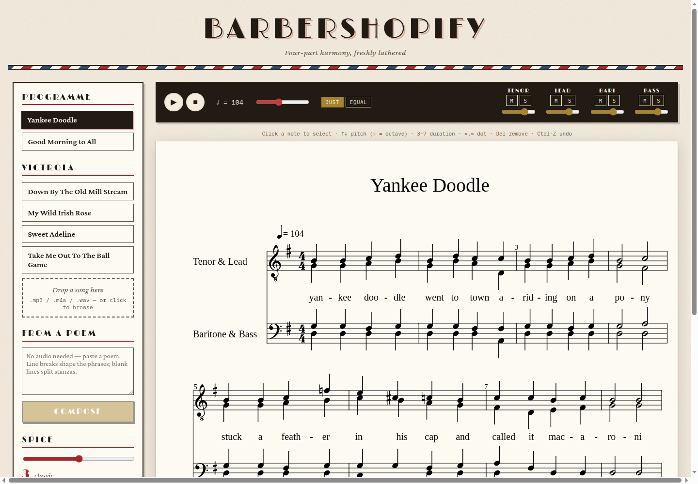

# barbershopify

Turn any song — or any poem — into a four-part barbershop quartet arrangement, rendered as
real sheet music you can play back, edit, and export. Upload an MP3 and the app finds the
melody, the chords, and even the words; or paste a poem and it composes an original chart
from scratch. A "spice" dial goes from faithful-and-singable to contest showpiece.



## What you need first

Install these four things (each link has one-click installers):

| Tool | Version | macOS | Windows / Linux |
|---|---|---|---|
| **git** | any recent | `brew install git` or [git-scm.com](https://git-scm.com/downloads) | [git-scm.com](https://git-scm.com/downloads) / `sudo apt install git` |
| **Python** | **3.12** | `brew install python@3.12` or [python.org](https://www.python.org/downloads/) | [python.org](https://www.python.org/downloads/) / `sudo apt install python3.12 python3.12-venv` |
| **Node.js** | 20 or newer | `brew install node` or [nodejs.org](https://nodejs.org/) | [nodejs.org](https://nodejs.org/) / `sudo apt install nodejs npm` |
| **ffmpeg** | any recent | `brew install ffmpeg` | [ffmpeg.org](https://ffmpeg.org/download.html) / `sudo apt install ffmpeg` |

> **Windows users:** the smoothest path is [WSL2](https://learn.microsoft.com/windows/wsl/install)
> (Ubuntu), then follow the Linux commands inside it. Native Windows works too if you have
> `make` (via Git Bash) — or just run the two commands in the Makefile by hand (see below).

## Setup from zero

1. **Accept the GitHub invitation** (check the email tied to your GitHub account, or
   [github.com/notifications](https://github.com/notifications)).
2. **Clone the private repo.** Easiest with the GitHub CLI:
   ```bash
   gh repo clone derekhaase259/barbershopify
   ```
   or plain HTTPS (it will ask for your GitHub username and a
   [personal access token](https://github.com/settings/tokens) as the password):
   ```bash
   git clone https://github.com/derekhaase259/barbershopify.git
   ```
3. **Install everything** (one command — creates the Python venv, installs backend and
   frontend dependencies; takes a few minutes the first time):
   ```bash
   cd barbershopify
   make setup
   ```
4. **Run it:**
   ```bash
   make dev
   ```
   then open the URL Vite prints (usually **http://localhost:5173**). Leave the terminal
   running; Ctrl-C stops both servers.

<details>
<summary>No <code>make</code>? The two commands it runs</summary>

```bash
# setup
cd backend && python3 -m venv .venv && .venv/bin/pip install -r requirements.txt && .venv/bin/pip install -e . && cd ..
cd frontend && npm install && cd ..
# run (two terminals)
cd backend && .venv/bin/uvicorn app.main:app --port 8731
cd frontend && npm run dev
```
</details>

## How to use it

- **Try it instantly:** click a tune under **Programme** (built-in demos, no audio analysis
  needed) — a four-part chart appears in about a second.
- **Real records:** the **Victrola** section has four public-domain 78s from 1905–1913
  bundled in the repo. Click one; analysis takes ~15–60 seconds the first time (it's
  finding the beat, key, melody, chords, and listening for words) and is instant after
  that. Honest warning: ASR on a century-old 78 is rough — that's why every lyric is
  editable, and why uncertain transcriptions fall back to "doo"/"dah".
- **Your own song:** drop an `.mp3`, `.m4a`, or `.wav` on **"Drop a song here."**
- **From a poem:** paste any poem into **From a Poem** and hit **Compose** — no audio at
  all. A sad poem comes back minor and slow; a joyful one major and quick. **Re-compose**
  rolls a fresh melody for the same words.
- **Spice (1–5):** how adventurous the harmony gets — secondary dominants, diminished
  passing chords, swipes on held notes, and (spice 3+) a proper tag ending. Move the
  slider and hit **Re-arrange**; analysis is cached so it's instant.
- **Playback:** ▶ / ■, tempo slider, and per-voice **M**ute / **S**olo with volume — solo
  your part to learn it. The cursor follows the music.
- **JUST vs EQUAL:** the toggle in the black bar. JUST tunes every chord to pure ratios
  (the dominant 7th sits 31 cents flat of a piano's) — flip it back and forth on a held
  chord and listen for the "lock and ring."
- **Editing:** click any note, then ↑/↓ to change pitch (Shift = octave), **3–7** for
  duration (sixteenth → whole), **.** for a dot, **Delete** to remove, **Ctrl-Z** /
  **Ctrl-Shift-Z** undo/redo. Click a lead note to edit its syllable in the sidebar, or
  paste whole new lyrics in the **Lyrics** panel — each phrase gets a green/yellow/red
  "fit" report.
- **Export:** **⤓ MusicXML** (opens in MuseScore, Finale, Sibelius) or **⤓ MIDI**.

## When something goes wrong

| Symptom | Fix |
|---|---|
| `ffmpeg: command not found` or upload fails instantly | Install ffmpeg (table above), restart `make dev`. |
| `python3.12: not found` / venv errors | You're on an older Python. Install 3.12 and rerun `make setup`. |
| Port already in use (8731 or 5173) | Something else is using it. `make dev BACKEND_PORT=8732` and edit the port in `frontend/vite.config.ts` to match — or stop the other program. Vite picks 5174 by itself if 5173 is busy; use the URL it prints. |
| First Victrola song or upload takes forever | The speech-recognition model (~150 MB) downloads on first use. It's a one-time cost; later songs are much faster. |
| "You are sending unauthenticated requests to the HF Hub" | Harmless. That's the speech model downloading from Hugging Face; anonymous downloads are fine. It only happens once. |
| Upload fails with "no melody could be extracted" | Dense modern mixes (heavy drums, thick production) can defeat the melody tracker. Songs with a clear, prominent melody — like the bundled 78s — work best. |
| Page loads but charts never appear | The backend probably isn't running — look for errors in the `make dev` terminal. |
| No sound | Click somewhere on the page first (browsers block audio until you interact), and check the per-voice mute buttons. |

## Under the hood (for the curious)

Python/FastAPI backend: audio analysis (librosa + faster-whisper), a rule-based
arrangement engine (two-stage Viterbi over chords then voicings, with a barbershop
chord-vocabulary validator that names any rule violation by measure and beat), MusicXML
and MIDI serialization. React/Vite frontend: OpenSheetMusicDisplay engraving, Tone.js
playback with root-anchored just intonation. `SPEC.md` is the full project spec,
`DESIGN.md` explains the non-obvious choices, and `backend/tests/` (138 tests) is the
quality bar — run them with `make test`. Test recordings and their public-domain
provenance live in [`test_songs/SOURCES.md`](test_songs/SOURCES.md).
